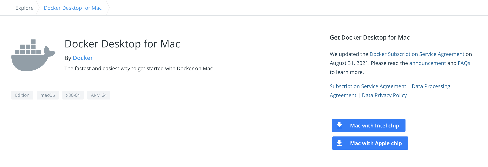
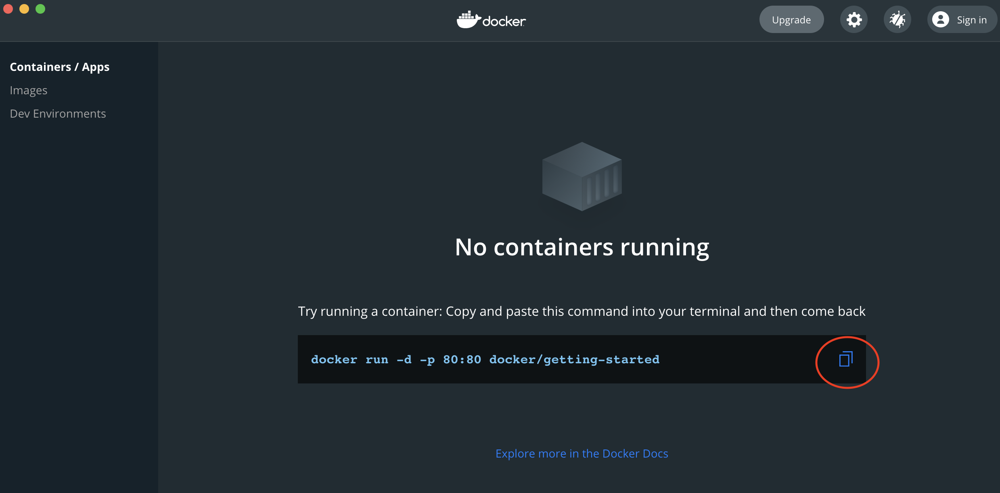
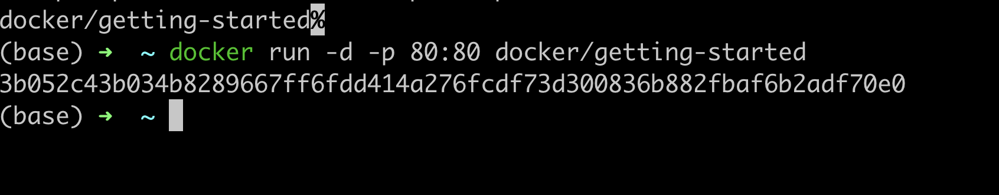
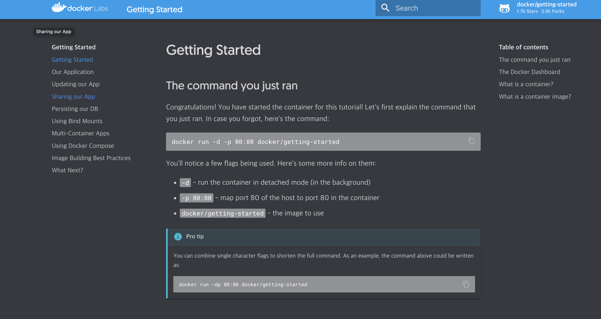

### 1. Docker?

Docker는 애플리케이션에 대한 구축,테스트를 표준화하여 컨테이너기반의 배포를 할 수 있는 플랫폼 입니다.

### 2. 공부한 이유

On-premise 환경에서 애플리케이션을 배포시 같은 사양의 서버라도 예상치 못한
문제에 직면한 경우가 생겼습니다. 이를 해결하기 위해서 Docker를 통해서
어디서든 동일한 실행환경을 구축하고 싶었습니다.

### 3. Mac에서 Docker 설치

도커 설치

[설치링크](hub.docker.com/editions/community/docker-ce-desktop-mac)

chip 타입을 확인하고 다운로드하여 설치합니다

설치가 완료되고 도커에서 제공해주는 **docker/getting-started** Image를 이용해서
컨테이너를 올려줍니다.

터미널상에서 커멘드 실행

명령어 입력후 [http://localhost/tutorial/](http://localhost/tutorial/) 접속하여
컨테이너 동작확인

# 다음

다음 설명부터는 도커의 기술적인 개념에 대해서
설명해보겠습니다.
