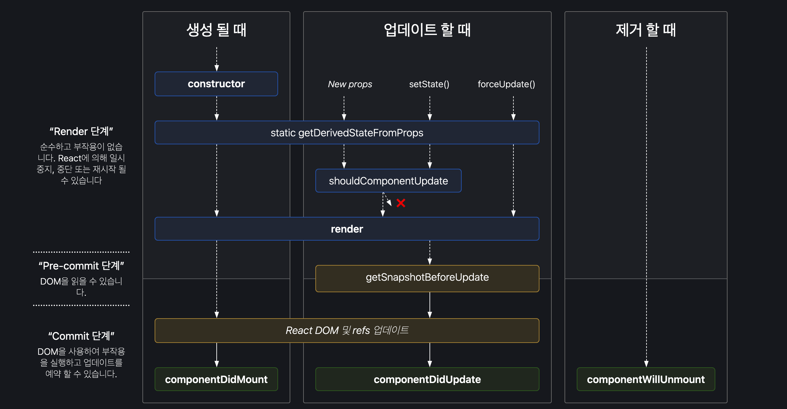

## 1. 작성 이유

React에서 컴포넌트를 다룰때 주요 관심사는 Mounting, Updating, 그리고 Unmounting 될 때가 아닐까요?  
그렇다면 Class 형태의 컴포넌트의 Lifecycle은 어떻게 동작하는지 이해와 언제 적용해야 하는지 알아보도록 하겠습니다.

## 2. 이해

전체적인 Lifecycle의 형태는 다음과 같습니다.



[[출처](https://projects.wojtekmaj.pl/react-lifecycle-methods-diagram)](https://projects.wojtekmaj.pl/react-lifecycle-methods-diagram)

크게 생성될때, 업데이트 할때 그리고 제거 될때를 기준으로 나눠 봅시다.

### Mounting

생성될 때(Mounting)라는 것은 컴포넌트에 존재하는 Element를 DOM에 밀어 넣는다는 것을 의미합니다.  
 4가지의 메소드를 통해서 Mounting 과정을 살펴보도록 하겠습니다.

- constructor()
- getDerivedStateFromProps()
- render()
- componentDidMount()

#### constructor

이해:

constructor() 메소드는 컴포넌트 생성시 가장 먼저 호출 됩니다.

---

사용목적: 주된 사용목적은 다음과 같습니다.

- this.state에 객체를 할당하여 지역 state를 초기화

- 인스턴스에 이벤트 처리 메서드를 바인딩

---

참고:

메서드를 바인딩하거나 state를 초기화하는 작업이 없다면, 해당 React 컴포넌트에는 생성자를 구현하지 않아도 됩니다.

```javascript
class Page extends React.Component {
  constructor(props) {
    super(props);

    this.handleClick = this.handleClick.bind(this); // 인스턴스에 이벤트 처리 메서드를 바인딩

    //주의사항
    //props를 받아서 바로 사용하는 경우 color props 변해도 state.color는 변경 불가
    this.state = { color: props.color };
    //여기서 this.setState()를 호출하면 하지 안도록 주의
    this.setState(state => state.count + 1);
    //아래 방식으로 초기화 해야 합니다.
    this.state = { count: 2 }; // this.state에 객체를 할당하여 지역 state를 초기화
  }

  render() {
    return <h1>{this.state.count}</h1>;
  }
}
```

#### getDerivedStateFromProps

이해:

getDerivedStateFromProps() 메소드는 element를 DOM에 밀어넣기 직전 호출 됩니다.  
생성될때 갱신 시점 모두에서 constructor() 다음으로 호출 됩니다.  
인자로 props, state를 가지고 있으며 return 값을 통해 state를 업데이트 할 수 있습니다.

---

사용목적:

주된 사용목적은 state 값이 props에 의해 결정되는 경우에 사용합니다.

- props 로 받아온 것을 state 에 넣어주고 싶을 때 사용합니다. 컴퍼넌트를 처음 생성할때 전달받은 props에 의해서
  랜더링되기 이전에 state가 변경되는 경우

---

참고:

공식문서상에는 코드가 장황해지고 이에따라 컴포넌트를 이해하기 어려워지기 떄문에 사용을 권장하지 않습니다.  
사용하기 전 아래 내용에 해당한다면 사용을 대체합니다.

---

- 이 메서드는 컴포넌트 인스턴스(this)에 접근할 수 없습니다.
- props 변화에 대응한 부수 효과를 발생시켜야 한다면 (예를 들어, 데이터 가져오기 또는 애니메이션), componentDidUpdate  
  생명주기를 대신해서 사용하세요.
- props가 변화했을 때에만 일부 데이터를 다시 계산 하고 싶다면, Memoization Helper를 대신해서 사용하세요.
- props가 변화할 때에 일부 state를 재설정 하고 싶다면, 완전 제어 컴포넌트 또는 key를 사용하는 완전 비제어 컴포넌트로 만들어서 사용하세요.

```javascript
class Header extends React.Component {
  state = {
    isScrollingDown: false,
    lastRow: null,
  };

  static getDerivedStateFromProps(props, state) {
    if (props.currentRow !== state.lastRow) {
      //전달받은 props로 내부 state의 값을 변경합니다.
      return {
        isScrollingDown: props.currentRow > state.lastRow,
        lastRow: props.currentRow,
      };
    }

    // null 리턴할 경우 상태 변경이 없습니다.
    return null;
  }
}
```

---

#### render

이해:

render() 순수함수이며 유일해야 하며, 컴포넌트 생성 시 꼭 필요로 하는 메서드입니다.

---

사용목적:

주된 사용목적은 컴포넌트를 렌더링하는 메서드입니다.

- props 로 받아온 것을 state 에 넣어주고 싶을 때 사용합니다. 컴퍼넌트를 처음 생성할때 전달받은 props에 의해서
  랜더링되기 이전에 state가 변경되는 경우

---

참고:

반환값으로는 아래 것들 중 하나를 반환해야 합니다.

- React 엘리먼트. 보통 JSX를 사용하여 생성됩니다. 예를 들어, \<div \/>와 \<MyComponent />는 React가 DOM 노드 또는 사용자가 정의한 컴포넌트를 만들도록 지시하는 React 엘리먼트입니다.

- 배열과 Fragment. render()를 통하여 여러 개의 엘리먼트를 반환합니다. 자세한 정보는 Fragments 문서를 통하여 확인할 수 있습니다.

- Portal. 별도의 DOM 하위 트리에 자식 엘리먼트를 렌더링합니다. 자세한 정보는 Portals에서 확인할 수 있습니다.
  문자열과 숫자. 이 값들은 DOM 상에 텍스트 노드로서 렌더링됩니다.

- Boolean 또는 null. 아무것도 렌더링하지 않습니다. (대부분의 경우 return test && <Child /> 패턴을 지원하는 데에 사용되며, 여기서 test는 boolean 값입니다.)

```javascript
class Page extends React.Component {
  render() {
    //render 함수
    return <h1>Render</h1>;
  }
}
```

#### componentDidMount

이해:

componentDidMount() 컴포넌트가 마운트 되고 나서 실행되는 메소드 입니다.
DOM 노드가 있어야 하는 초기화 작업은 이 메서드에서 이루어지면 됩니다. 외부에서 데이터를 불러와야 한다면, 네트워크 요청을 보내기 적절한 위치입니다.

---

사용목적:

axios, fetch 등을 통하여 ajax 요청을 하거나, DOM 의 속성을 읽거나 직접 변경하는 작업을 진행합니다.

---

참고:

componentDidMount()에서 즉시 setState()를 호출하는 경우도 있습니다. 이로 인하여 추가적인 렌더링이 발생하지만, 브라우저가 화면을 갱신하기 전에 이루어질 것입니다. 이 경우 render()가 두 번 호출되지만 DOM이 존재해야만 가능한 작업  
DOM의 크기나 위치가 필요한 Modal 등

```javascript
class Page extends React.Component {


  componentDidMount() {
      await this.getSources() //DOM이 마운트 되고 외부 데이터를 가져오는 경우 사용
  }

}
```

### Updating

업데이트 할 때 라는 것은 컴포넌트에 props 또는 state가 변경될때를 말합니다.

5가지의 메소드를 통해서 Updating 과정을 살펴보도록 하겠습니다.

- getDerivedStateFromProps()
- shouldComponentUpdate()
- render()
- getSnapshotBeforeUpdate()
- componentDidUpdate()

#### getDerivedStateFromProps

생성시점에서 살펴본 getDerivedStateFromProps 과 동일하기 때문에 생략합니다.

#### shouldComponentUpdate

이해:

props 또는 state가 새로운 값으로 갱신되어서 렌더링이 발생하기 직전에 호출됩니다. 기본 return 값은 true입니다. 이 메서드는 초기 렌더링 또는 forceUpdate()가 사용될 때에는 호출되지 않습니다. return 값이 false인 경우 업데이트를 수행하지 않습니다.

---

사용목적:

이 메서드는 오직 성능 최적화만을 위한 것입니다.
shouldComponentUpdate는 현재 props, state 와 변경된 props, state를 비교할 수 있기 때문에 이를 통해
업데이트 여부를 결정 할 수 있습니다.

---

참고:

shouldComponentUpdate() 내에서 deep compare 나 JSON.stringify()를 사용하는 것을 권하지 않습니다. 아주 비효율적이며 성능을 떨어트릴 수 있습니다.

```javascript
public shouldComponentUpdate(nextProps) {
  const {location} = nextProps

  if (
    !this.state.isFetching &&
    this.props.location.pathname === location.pathname
  ) {
    return false // false 반환시 업데이트가 수행되지 않습니다.
  }

  return true // 기본값
}

```

#### render

생성시점에서 살펴본 render 과 동일하기 때문에 생략합니다.

#### getSnapshotBeforeUpdate()

이해:

가장 마지막으로 렌더링된 결과가 DOM 등에 반영되기 전에 호출됩니다. 이 메서드를 사용하면 컴포넌트가 DOM으로부터 스크롤 위치 등과 같은 정보를 이후 변경되기 전에 얻을 수 있습니다. 이 생명주기 메서드가 반환하는 값은 componentDidUpdate()에 인자로 전달됩니다.

---

사용목적:

이 메서드에 대한 사용례는 흔하지 않지만, 채팅 화면처럼 스크롤 위치를 따로 처리하는 작업이 필요한 UI 등을 생각해볼 수 있습니다. componentDidUpdate 이전에 작업을 처리하고 넘겨줄 필요가 있는 경우 고려해볼만 합니다.

```
class Demo extends React.Component {

   getSnapshotBeforeUpdate(prevProps, prevState){
      console.log(5,prevState.x,this.state.x);
      return 999;
   }
   componentDidUpdate(prevProps, prevState, snapshot) {
      console.log(6,snapshot);
   }

}

```

#### componentDidUpdate()

이해:

componentDidUpdate 는 초기에는 호출되지 않고 업데이트가 수행되고 최종적으로 수행되는 메소드 입니다.

---

사용목적:

컴포넌트가 갱신되었을 때 DOM을 조작하기 위하여 이 메서드를 활용하면 좋습니다. 또한, 이전과 현재의 props를 비교하여 네트워크 요청을 보내는 작업도 이 메서드에서 이루어지면 됩니다 (가령, props가 변하지 않았다면 네트워크 요청을 보낼 필요가 없습니다)

---

참고:

상위에서 내려온 prop을 그대로 state에 저장하는 것은 좋지 않으며, 그 대신 prop을 직접 사용하는 것이 좋습니다.

```javascript

  public async componentDidMount() {
    if (this.state.isRouting) {
      return
    }
    if (this.isComponentMounted && this.isMeasurementInNamespace)
      this.updateTableData(SearchStatus.Loading)
    }
    // 특정 조건없이 setState를 실행할 경우 계속 업데이트가 실행되기 떄문에 아래와 같이 작성하는 경우 주의
    this.setState({
      max: this.props.numbers
    });

```

### UnMounting

제거 할 때 라는 것은 컴포넌트에 props 또는 state가 변경될때를 말합니다.

- componentWillUnmount

#### componentWillUnmount

이해:

componentWillUnmount(()는 컴포넌트가 제거 직전에 호출됩니다.

---

사용목적:

이 메서드 내에서 타이머 제거, 네트워크 요청 취소, componentDidMount() 내에서 생성된 구독 해제 등 필요한 모든 정리 작업을 수행하세요.

---

참고:

이제 컴포넌트는 다시 렌더링되지 않으므로, componentWillUnmount() 내에서 setState()를 호출하면 안 됩니다. 컴포넌트 인스턴스가 마운트 해제되고 나면, 절대로 다시 마운트되지 않습니다.

```javascript
  public componentWillMount() {
    this.debouncedHandleSearch = _.debounce(this.handleSearch, 50)
  }
```
