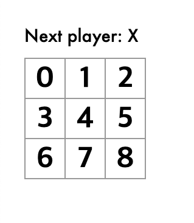

## 1. 작성 이유

문서에 기반한 정리하는 연습을 해보고 싶어서 작성해보려고 합니다.  
공식문서를 따라 해보면서
튜토리얼을 목차를 따라 가보면서 제가 튜툐리얼을 따라가면서 중요하다 생각하는 개념 위주로 정리했습니다.  
옆에 [공식문서](https://reactjs.org/tutorial/tutorial.html#adding-time-travel)를 띄어놓고 같이 봐주시기 바랍니다.

## 2. 정리

### Before We Start the Tutorial

the tic-tac-toe 게임을 만들어 나가면서 주요 개념에 대해서 설명한다고 합니다.

이 튜토리얼을 따라가기 위해서는 ES6 버전의 Javascript의
[arrow functions](https://developer.mozilla.org/en-US/docs/Web/JavaScript/Reference/Functions/Arrow_functions), [classes](https://developer.mozilla.org/en-US/docs/Web/JavaScript/Reference/Classes), [let](https://developer.mozilla.org/en-US/docs/Web/JavaScript/Reference/Statements/let), 그리고 [const](https://developer.mozilla.org/en-US/docs/Web/JavaScript/Reference/Statements/const) 특징을 알아야 합니다.

리엑트에 집중할 수 있도록 선수지식에 대해서는 제외하고 정리를 하였습니다.

### Setup for the Tutorial

이 튜토리얼을 실습하기 위해서는 브라우저를 통한 방법과 자신의 로컬 환경을 구축하고 실습하는
방법을 2가지를 지원합니다.

개념학습에 집중하기 위해서 [브라우저를 통한 코드 작성](<(https://codepen.io/gaearon/pen/oWWQNa?editors=0010)>) 방법을 선택하겠습니다.

### Overvieew

1. What Is React?

   리엑트는 선언적이고 효율적이며 유연한 자바스크립트 라이브러리 입니다.

   선언적, 효율적, 유연한 이라는 키워드는 튜토리얼을 진행해 나가면서 점차 경험할 수 있었습니다.

   **컴포넌트**라는 작고 독립된 코드를 통해서 복잡한 UI를 구성합니다.
   앞으로 이 컴포넌트라는 단위를 기준으로 리엑트에 대해서 이해 해보도록 합시다.

   튜토리얼에서 가장 처음 접하게 되는 **컴포넌트**는 **Class**형태의 **React.Component** 입니다.

   ```javascript
   class ShoppingList extends React.Component {
     render() {
       return (
         // 화면에 출력하고 싶은 데이터
         <div className="shopping-list">
           <h1>Shopping List for {this.props.name}</h1>
           <ul>
             <li>Instagram</li>
             <li>WhatsApp</li>
             <li>Oculus</li>
           </ul>
         </div>
       );
     }
   }

   // Example usage: <ShoppingList name="Mark" />
   ```

   전체적인 코드는 [XML](https://ko.wikipedia.org/wiki/XML)의 형태와 비슷합니다.

   `render()`라는 함수의 `return` 메소드를 통해서 `React element`를 반환하게 됩니다.
   이를 통해 화면에 `React element`가 랜더링 됩니다.

   쉽게 말해서 화면에 뿌려줄 부분에 해당합니다.(Rendering)
   시작부터 여러 개념들이 나오기 시작하면서 위기가 찾아 오기 시작합니다..

   모든 개념들을 이해하면서 진행하면 좋지만 이번에는 리엑트를 이해하고 사용하는데 필요한 기본적인 개념부분을 먼저 정리 하였습니다.

   여기서 눈여겨 봐야할 코드는 `{this.props.name}` 입니다.
   `props` 란 propertiess의 줄임말로 컴포넌트가 가지고 있는 속성으로 다음으로 나올 `state`와 함께
   리엑트를 사용함에 있어서 제일 많이 접하는 키워드입니다.

   `React element`는 아래와 같은 형태로 빌드되어 화면에 출력 되게 됩니다.
   단 `xxx.JSX` 라는 확장자의 파일로 React 코드를 작성한다면 아래와 같은 작성하게 번거로운 방식으로
   코드를 작성하지 않아도 됩니다.

   ```javascript
   return React.createElement(
     "div",
     { className: "shopping-list" },
     React.createElement("h1" /* ... h1 children ... */),
     React.createElement("ul" /* ... ul children ... */)
   );
   ```

   `<ShoppingList name="Mark" />` 이처럼 작성된 컴포넌트는 `<div />`태그를 사용하듯
   동일한 방법으로 사용 할 수 있습니다.

<br/>

2. Inspecting the Starter Code  
   [Starter Code](https://codepen.io/gaearon/pen/oWWQNa?editors=0010).를 통해 튜토리얼을 진행합니다.

   3가지의 컴포넌트를 구성하게 됩니다.

   - Square
   - Board
   - Game

<br/>

3. Passing Data Through Props  
   이제 본격적으로 Props를 통해서 데이터를 넘기는 방법에 대해서 배우게 됩니다.  
   설명되는 코드를 따라가보며 이해하기 위해 노력합시다.  
   추가적으로 코드에 주석을 통해서 흐름을 따라가기 쉽게 하려고 합니다.  
   Board와 Square 를 아래와 같이 변경합니다.

   ```javascript{2-3}
   class Board extends React.Component {
     renderSquare(i) {
       return <Square value={i} />; // 이제 Square는 props.value 값을 가집니다.
     }
   }
   ```

   ```javascript{3}
   class Square extends React.Component {
     render() {
       return <button className="square">{this.props.value}</button>; //<Square value={i} /> 에서 전달받은 value를 랜더링 합니다.
     }
   }
   ```

   정상적으로 변경 했다면 화면에 숫자가 랜더링 됩니다. [여기까지 동작하는 코드](https://codepen.io/gaearon/pen/aWWQOG?editors=0010)
   

4. Making an Interactive Component

   다음은 Square 컴퍼넌트를 클릭 했을때 X 값으로 채우는 기능을 추가함으로서 컴포넌트에 단순 props를 통한 상태값만을  
    표시하는게 아니라 상호작용을 할 수 있는 컴포넌트로 변경할 수 있는 방법을 설명합니다.  
    이제 `state` `onEvent`가 등장하게 됩니다. [여기까지 동작하는 코드](https://codepen.io/gaearon/pen/VbbVLg?editors=0010)

   ```javascript{7-9}
   class Square extends React.Component {
     /* 클래스형 컴포넌트가 state를 가지기 위해서는 아래 constructor를 작성해야 합니다.
     state를 가지기 위한 형식적인 코드라고 생각하면 됩니다.
     */
     constructor(props) {
       super(props);
       this.state = {
         value: null,
       };
     }

     render() {
       /* 
       onEvent중 하나인 onClick에 누를때 마다 this.setState 를 호출하는 함수를 추가 합니다.
       react 에서는 this.setState을 통해 state 의 값을 변경합니다.
       주의 할 점은 onClick(setState({value:'X'})) 처럼 즉시 실행하는 식으로 코드를 작성하면
       안됩니다. 항상 실행 할 수 있는 함수를 넘긴다는 생각으로 작성해야 합니다.
       */

       return (
         <button
           className="square"
           onClick={() => this.setState({ value: "X" })}
         >
           {this.state.value}
         </button>
       );
     }
   }
   ```

    <br/>

5. Developer Tools
   개발에 도움을 주는 툴에 대한 설명으로 크롬과 파이어 폭스의 확장 프로그램을 통해 추가하여 사용하는 방법에 대해서 설명합니다.
   디버깅은 중요하지만 현재 튜토리얼에는 비중이 낮아 넘어가도록 합니다.

### Completing the Game

1.  Lifting State Up  
    기존 컴포넌트는 Square마다 onClick Event와 `State`를 가지고 있습니다.
    이게 무슨 문제가 될까요?  
    구현된 코드가 동작하는데는 아무 문제가 없습니다.

    여기서 잠깐 리엑트는 무엇인가로 잠시 돌아가 보겠습니다.
    선언적이고 효율적이며 유연하다 라는 특징을 유지하기 위해서는
    `state`관리가 핵심입니다. 이 튜토리얼에서는 간단한 3개의 컴포넌트지만

    향후 복잡한 컴포넌트를 다루면 과연 모든 컴포넌트의 `state`에 대해서 확인하는 것은 쉽지 않습니다.

    따라서 부모 컴포넌트로 `state`에 대한 처리를 올려 컴포넌트에 `props`의 변경만으로

    재사용을 통해 효율적이고 유연적인 코드를 작성할 수 있게 됩니다.

    다음은 기존 작성된 `state`를 부모 컴퍼넌트로 올리는 방법에 대해서 설명합니다.

    Board와 Square컴포넌트를 아래와 같이 변경 합니다.
    [여기까지 동작하는 코드](https://codepen.io/gaearon/pen/gWWQPY?editors=0010)

    ```javascript{}
        class Board extends React.Component {
          constructor(props) {
            super(props)
            this.state = {
              squares: Array(9).fill(null), // sqaures 초기값
            }
          }

            handleClick(i) {
              const squares = this.state.squares.slice();
              squares[i] = 'X';
              this.setState({squares: squares});
            }

            renderSquare(i) {
              //Board -> square로 value와 onClick을 내려줍니다.

              return return
              ( <Square value={this.state.squares[i]}
                onClick={() => this.handleClick(i)}/>;
                )
            }
            render() {
            const status = 'Next player: X';

            return (
              <div>
                <div className="status">{status}</div>
            }
            ...
    ```

    ```javascript{}
    class Square extends React.Component {
      /*이제 상태가 존재하지 않기 떄문에 constructor를 제거 합니다.*/
      //   constructor(props) {
      //   super(props)
      //   this.state = {
      //     value: null,
      //   }
      // }

      render() {
        return (
          //전달 받은 props를 통해서 구현합니다.
          <button className="square" onClick={() => this.props.onClick()}>
            {this.props.value}
          </button>
        );
      }
    }
    ```

    <br>

2.  Why Immutability Is Important

    왜 불변성(Immutability)이 중요한지 다음 아래 예제 데이터 코드를 통해 설명합니다.

    ```javascript
    //불변성이 지켜지지 않는 경우
    var player = { score: 1, name: "Jeff" };
    player.score = 2;
    // Now player is {score: 2, name: 'Jeff'}

    var player = { score: 1, name: "Jeff" };

    //불변성이 지켜지는 경우
    var newPlayer = Object.assign({}, player, { score: 2 });
    // Now player is unchanged, but newPlayer is {score: 2, name: 'Jeff'}

    // Or if you are using object spread syntax proposal, you can write:
    // var newPlayer = {...player, score: 2};
    ```

    코드를 보면 뭐.. 그렇구나 하게 됩니다.
    튜토리얼에서는 몇가지 예시를 들어주며 왜 불변성이 유지 되어야 하는지 설명해 줍니다.

    - 복잡한 기능을 간단하게 만든다.  
       이 튜토리얼 후반부에 소개할 "time travel" 기능에서 유용성을 설명 해준다고 합니다.

    - 변경감지  
       변경 가능한 객체는(mutable object) 변경 여부를 찾기 위해서는 전체 객체 트리에서 찾아야
      하기 때문에 불변 객체가 변경 감지에 더 쉽습니다.

    - **리엑트의 리랜더링 여부 결정**  
       리엑트로 작성된 코드에서 항상 큰 고민을 주는 부분중 하나는 불필요한 리랜더링을 줄이는 것입니다.
      여기서 불변성이 지켜진다는 것은 리엑트에서 리랜더링 여부를 결정하는 중요한 요소가 됩니다.
      이 리랜더링 결정여부는 변경감지를 통해서 복잡한 기능을 더 간단하게 만들어주기 때문에
      불변성이 지켜져야 하는 가장큰 이유라 생각됩니다.

  <br/>

3. Function Components

   튜토리얼 상의 함수형 컴포넌트는 state를 가지고 있지 않는 컴포넌트를 표현할때 함수형으로 사용해야 한다
   라고 설명해주고 있습니다. 요즘 함수형 컴포넌트를 사용하는 방향이랑은 차이가 있으나
   본질적으로 함수형 컴포넌트가 존재하게 된 이유라 생각합니다.

   아래 코드는 Square 클래스를 함수형태로 변경한 코드입니다.[여기까지 동작하는 코드](https://codepen.io/gaearon/pen/QvvJOv?editors=0010)

   ```javascript
   function Square(props) {
     return (
       <button className="square" onClick={props.onClick}>
         {props.value}
       </button>
     );
   }
   ```

4. Taking Turns & Declaring a Winner  
   O , X 로 서로 순서를 가지도록 코드를 추가합니다. 추가적인 개념이 나오는게 아니기 때문에
   설명은 생략하겠습니다.[여기까지 동작하는 코드](https://codepen.io/gaearon/pen/LyyXgK?editors=0010)

### Adding Time Travel

1. Storing a History of Moves & Lifting State Up, Again & Showing the Past Moves

   불변성이 지켜진 Squares array를 통해서 state의 history를 만들게 됩니다.  
    history state를 관리하기 위해서 top-level의 Game 컴포넌트 까지  
    다시 한번 상태를 끌어 올립니다. 특별히 중요한 개념적인 내용이 없어 생략하였습니다.

   [여기까지 동작하는 코드](https://codepen.io/gaearon/pen/EmmGEa?editors=0010)  
   <br/>

2) Picking a Key

   **마지막으로 중요한 내용입니다.** 여기서는 리스트 형태의 컴포넌트를 호출할때 key가 추가 되어야 하는 이유와 어떻게 추가해주는지
   설명합니다.

   ```javascript
     //key가 없기 떄문에 React에서 변경탐지가 어려워요..
     <li>Ben: 9 tasks left</li>
     <li>Claudia: 8 tasks left</li>
     <li>Alexa: 5 tasks left</li>

     //key를 추가해야 합니다!
     //key는 유일값이여야 하지만 이것은 동적요소의 형제들과 구분되는 값을 의미 합니다.
     //모든 컴포넌트에서 유일값에 해당하지 않다는 것 입니다.
     <li key={user.id}>tasks left</li>
   ```

3. Implementing Time Travel  
   key까지 추가된 상태에서의 [최종코드](https://codepen.io/gaearon/pen/gWWZgR?editors=0010) 입니다.
